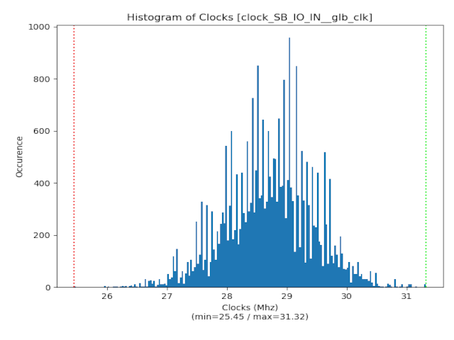
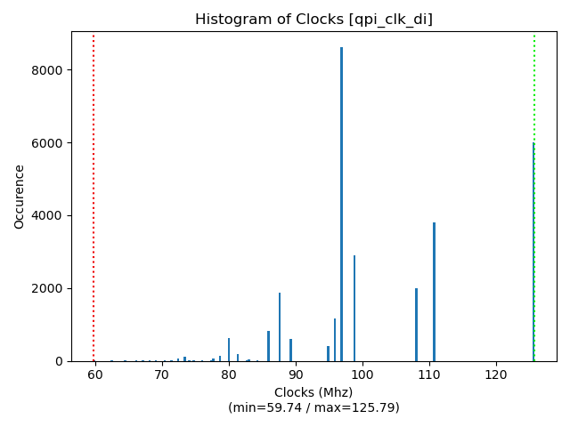
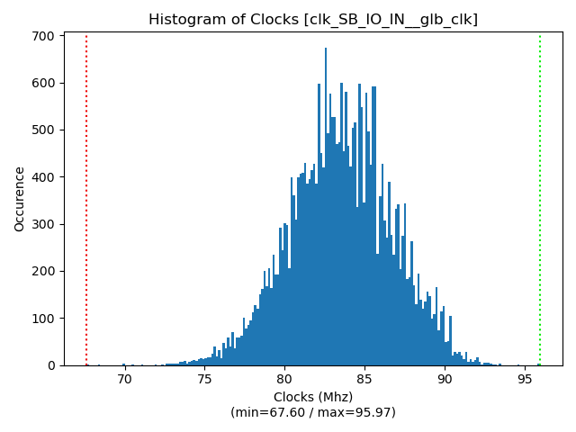

# An effort to test various annealers for nextpnr

---

## NextPNR hyperparam optimization

Hyperparameter annelars for nextpnr are available in ```tunners```:

  | Tunner | MultiAlgo | Parallel |
  |-----------------------------------------------------------|---|---|
  | [Mongo](https://github.com/ARM-software/mango)            | N | Y |
  | [HyperActive](https://github.com/SimonBlanke/Hyperactive) | Y | N |
  | [Optuna](https://github.com/optuna/optuna)                | Y | N |
  | [HyperOpt](https://github.com/hyperopt/hyperopt)          | Y | N |

Running the tunner is simple, just prepend one:


## The brute force experiment

Given a configuration [space](https://github.com/cbalint13/nextpnr-anneal/blob/master/bench/marlann/nextpnr-explore.py#L13-L16) brute force exploration can be done:
  
  * ```0-explore-brute.sh``` will explore the space (will take some time)
  * ```1-parse-results.sh``` will aggregate log results into a JSON file
  * ```2-graph-results.sh``` will display histogram occurences of yielded clock speeds
 
| Experiment | Image1 | Image2 |
| ---------- | ------ | ------ |
| MARLANN    |Default: 28.21 Mhz|Default: 96.79 Mhz|
| PicoRV32   |Default: 89.79 Mhz||


## Future goal (WiP)

Given parameter space:

  * track early features extracted from several nexpnr startups
  * encode early features in metric measurable feature vectors
  * generate a cost model (xgboost) in TVM [autotune](https://github.com/apache/tvm/issues/1311) fashion
  * try fit/estimate/predict out from learned model the best set
